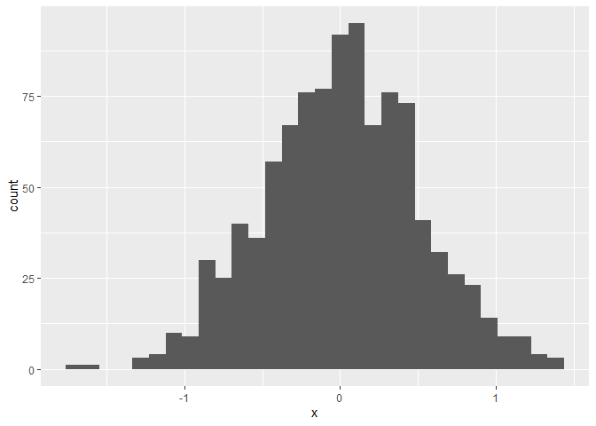
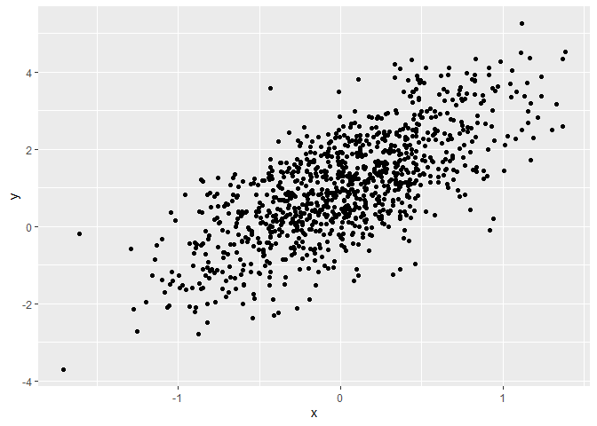
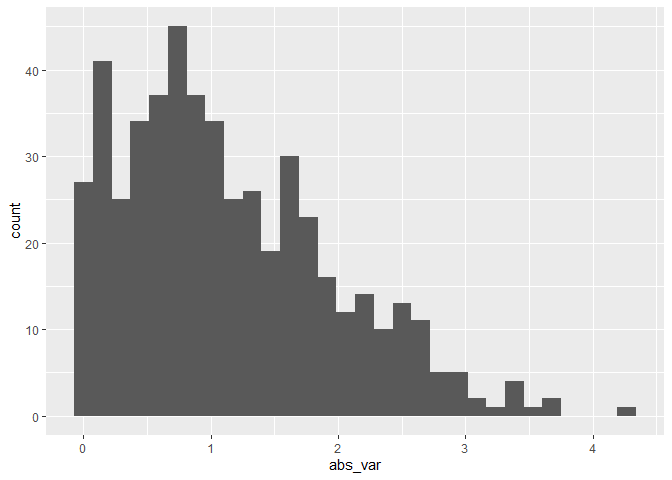

Simple document
================
Helen Peng

I’m an R Markdown document!

# Section 0: libraries

    ## Warning: package 'tidyverse' was built under R version 4.4.3

# Section 1

Here’s a **code chunk** that samples from a *normal distribution*:

``` r
samp = rnorm(100)
length(samp)
```

    ## [1] 100

# Section 2

I can take the mean of the sample, too! The mean is -0.0532862.

# Section 3: a tibble

``` r
plot_df = tibble(
  x = rnorm(1000, sd = .5),
  y = 1 + 2 * x + rnorm(1000)
)

head(plot_df)
```

    ## # A tibble: 6 × 2
    ##         x     y
    ##     <dbl> <dbl>
    ## 1 -0.225  2.57 
    ## 2  0.733  0.787
    ## 3 -0.0335 0.742
    ## 4  0.147  1.49 
    ## 5  0.0551 2.20 
    ## 6  0.390  3.49

# Section 4: plots

These are plots from are random sample.

    ## `stat_bin()` using `bins = 30`. Pick better value `binwidth`.

<!-- --><!-- -->

# Section 5: Learning Assessment 2

Write a named code chunk that creates a dataframe comprised of: a
numeric variable containing a random sample of size 500 from a normal
variable with mean 1; a logical vector indicating whether each sampled
value is greater than zero; and a numeric vector containing the absolute
value of each element. Then, produce a histogram of the absolute value
variable just created. Add an inline summary giving the median value
rounded to two decimal places. What happens if you set eval = FALSE to
the code chunk? What about echo = FALSE?

This plot shows the distribution of the absolute value of
$X \sim N(1,1)$

``` r
set.seed(0)
assessment_df = tibble(
  num_var = rnorm(500, mean = 1),
  log_var = num_var > 0,
  abs_var = abs(num_var),
)

ggplot(assessment_df, aes(x = abs_var)) +
  geom_histogram()
```

    ## `stat_bin()` using `bins = 30`. Pick better value `binwidth`.

<!-- -->

``` r
median_sample = median(assessment_df$num_var) # my solution (don't use this because using the $ there is a possibility that it goes back and edit the df so it's better to just use the function pull)
median_samp = median(pull(assessment_df, num_var)) # actual solution (tidyverse solution)

median_sample == median_samp
```

    ## [1] TRUE

``` r
median_sample
```

    ## [1] 0.9446332

The median value is 0.94

why is my in-line different from the code chunk?? (probably because i
didn’t set seed? yeah that’s why)

Calculating the median value inline 0.94

# Section 6: formatting

## Text formatting

*italic* or *italic* **bold** or **bold** `code` superscript<sup>2</sup>
and subscript<sub>2</sub>

superscript<sup>3</sup> and subscript<sub>3</sub>

## Headings

# 1st Level Header

## 2nd Level Header

### 3rd Level Header

## Lists

- Bulleted list item 1

- Item 2

  - Item 2a

  - Item 2b

1.  Numbered list item 1

2.  Item 2. The numbers are incremented automatically in the output.

## Tables

| First Header | Second Header |
|--------------|---------------|
| Content Cell | Content Cell  |
| Content Cell | Content Cell  |

# Section 7: Learning Assessment 3

After the previous code chunk, write a bullet list given the mean,
median, and standard deviation of the original random sample.

- The median value is 0.94

- The mean value is 1

- The standard deviation is 0.99
